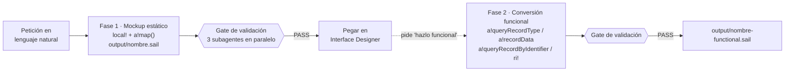

# Appian Toolkit

Plugin de [Claude Code](https://claude.com/claude-code) que convierte a Claude en un asistente de desarrollo Appian con tres capacidades: **generar interfaces SAIL validadas** (de mockup a funcional conectada al Data Fabric), **documentar aplicaciones heredadas** por reingeniería inversa de sus exports, y **estructurar análisis funcional** a partir de requisitos dispersos.

Los schemas SAIL del plugin están **sincronizados con Appian 26.x** y verificados contra la documentación oficial (no contra la memoria del modelo).

---

## 1 · Generación de interfaces SAIL — skill `appian-sail-generator`

Flujo en dos fases con validación obligatoria:



**Qué garantiza:**

- **Anti-invención**: nunca inventa UUIDs, campos, relaciones ni reglas de negocio. Si falta el modelo de datos, se detiene y lo pide (protocolo de STOP explícito).
- **Validación por schema**: cada función, parámetro y valor enumerado se comprueba contra schemas JSON de ~140 funciones SAIL; cada icono contra un catálogo de 1.100+ alias. Tres subagentes (`sail-schema-validator`, `sail-icon-validator`, `sail-code-reviewer`) revisan todo `.sail` generado antes de entregarlo.
- **Corrección de errores del Designer**: pega el error y lo mapea contra un catálogo de 14 categorías de errores comunes con su fix canónico, editando el fichero existente (no regenera).
- **Data Fabric al día**: árbol de decisión de queries (`a!recordData` vs `a!queryRecordType` vs `a!queryRecordByIdentifier`), agregaciones con `a!measure`/`a!grouping`, KPIs nativos con `a!kpiField`, relaciones con `a!relatedRecordData`, y null-safety sistemática (`applyWhen`, listas vacías, short-circuit con `if()`).
- **Fidelidad visual**: si aportas una imagen de referencia, extrae la paleta HEX y la aplica (nunca `"ACCENT"` para colores de marca); la conversión funcional preserva el diseño del mockup y solo cambia las fuentes de datos.

**Modelo de datos para la Fase 2** — se genera desde un export de record types:

```bash
python skills/appian-sail-generator/scripts/xml_to_appian_recordtype_md.py mi-record.xml -o context/data-model-context.md
```

---

## 2 · Reingeniería inversa — skill `appian-reverse-engineering`

A partir de un **export de aplicación Appian descomprimido** (formato Haul: `applicationHaul`, `processModelHaul`, `recordTypeHaul`… o el formato antiguo con `application.xml`), produce documentación para que un consultor nuevo entienda la aplicación:

- **11 documentos Markdown**: funcional, arquitectura, modelo de datos, seguridad y grupos, integraciones consumidas, APIs expuestas, batches, BPMN por process model, valor adicional/riesgos, inventario y resumen ejecutivo.
- **Diagramas**: BPMN 2.0 validado por process model, modelo ER en SVG, mapa de integraciones.
- **Seguridad por defecto**: detecta y **enmascara secretos** (tokens, passwords, claves API) antes de escribir nada — el export es interno, la documentación se comparte.
- Opcionalmente (preguntando antes): PDF maquetado o dashboard web navegable.
- Funciona **offline** sobre la carpeta del export; 6 agentes internos especializados (`interface-analyzer`, `process-modeler`, `data-modeler`, `integration-security-analyzer`, `pdf-publisher`, `dashboard-publisher`).

Uso: *"Documenta esta aplicación: ./exports/MiApp/"* — o pide directamente *"el BPMN del proceso de aprobación"* o *"el modelo ER"*.

---

## 3 · Análisis funcional — agente `appian-functional-analyst`

Transforma información dispersa (transcripciones de reuniones, correos del cliente, notas informales, capturas) en entregables funcionales estructurados con vocabulario Appian: requisitos con huecos detectados, especificaciones de pantalla (componentes, acciones, reglas de comportamiento), procesos de negocio e historias de usuario con criterios de aceptación en Gherkin.

---

## Subagentes del plugin

| Agente | Cuándo actúa |
|---|---|
| `sail-schema-validator` | Siempre, tras generar cualquier `.sail` — funciones/parámetros/enumerados contra los schemas |
| `sail-icon-validator` | Siempre — cada `icon:` contra el catálogo de alias |
| `sail-code-reviewer` | Siempre — revisión estructural, null-safety y 14 categorías de errores |
| `sail-dynamic-converter` | Al pedir "hazlo funcional / conéctalo a mis records" |
| `sail-interface-splitter` | Al pedir "divide/refactoriza esta interfaz en componentes" |
| `sail-validation-implementer` | Al aportar una definición de pantalla con validaciones para implementarlas |
| `appian-functional-analyst` | Ante material funcional a estructurar |

---

## Instalación

```bash
claude plugin marketplace add raulogm077/Appian-Toolkit
```

```bash
claude plugin install appian-toolkit@appian-toolkit
```

O clonando y cargando directamente:

```bash
git clone https://github.com/raulogm077/Appian-Toolkit.git
```

```bash
claude --plugin-dir ./Appian-Toolkit
```

**Requisitos**: Claude Code. Opcionales: Python 3.8+ (scripts de conversión de exports), MCP `appian-docs` (consultar documentación oficial en vivo) y un MCP de Appian con `validateExpression` (validar contra tu entorno real).

---

## Settings por proyecto (opcional)

Crea `.claude/appian-toolkit.local.md` en tu proyecto — plantilla en [`skills/appian-sail-generator/examples/appian-toolkit.local.md.example`](skills/appian-sail-generator/examples/appian-toolkit.local.md.example):

```markdown
---
brand_hex: "#0050A0"            # paleta corporativa (HEX, nunca "ACCENT")
data_model_context: "context/data-model-context.md"
output_dir: "output"
ai_components_available: true    # false → nunca genera a!chatField/a!callLanguageModel
prefer_native_kpis: true         # Fase 2: a!kpiField nativo cuando aplica
---
# Notas libres del proyecto (entorno, convenciones…)
```

Es un fichero local del proyecto (excluido por `.gitignore`), leído en el pre-flight de cada generación.

---

## Sincronización con Appian 26.x (v2.4.0)

- **Corregido**: `a!gridRowDeletion`/`rowDeletions` no existen en Appian (se documentaban por error); `fetchTotalCount` no es obligatorio — por defecto `false` desde la evolución 24r4, solo `true` cuando se lee `.totalCount`.
- **Añadido a los schemas**: `a!kpiField`, `a!queryRecordByIdentifier`, `a!selectionFields`, `a!eventHistoryListField` + `a!eventData`, `a!chatField` + `a!chatMessage` + `a!callLanguageModel` (IA), charts records-powered (`data` + `config`).
- **Parámetros 26.x**: `a!tabLayout(selectedTab)`, `a!tabItem(id, loadBehavior)`, grids con `smartSearchType`/`searchFields`/`showManageFiltersMenu`, estilos de selección sutiles, `borderStyle: "LIGHT_WITH_OUTER_BORDERS"`, reordenación de filas en grids editables, color `WARN`, stamp `EXTRA_TINY`.
- Los parámetros nuevos llevan `introducedIn` en los schemas; si tu entorno va por detrás (las upgrades mensuales de Appian Cloud son opt-in), verifica disponibilidad vía `appian-docs` antes de culpar al schema.

---

## Estructura del repositorio

```
.claude-plugin/               plugin.json + marketplace.json
agents/                       7 agentes del plugin (validadores, conversor, splitter, analista)
skills/
  appian-sail-generator/      SKILL.md · schemas JSON (~140 funciones) · catálogo de iconos
                              guías de layouts/componentes/lógica/conversión · scripts · ejemplos
  appian-reverse-engineering/ SKILL.md · 6 agentes internos · plantillas de los 11 documentos
                              reglas de seguridad/enmascarado · scripts (BPMN, secretos)
```

---

## Autor y licencia

Raúl Gómez Moya — [raulogm077](https://github.com/raulogm077)

Sin licencia de uso explícita por ahora (todos los derechos reservados). Abre un issue si quieres usarlo más allá de consulta.
