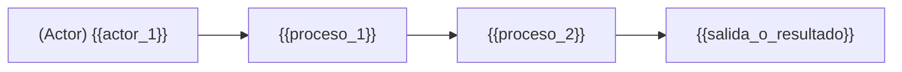

<!--
  Plantilla 01 — Explicación funcional
  Lenguaje de negocio, SIN jerga Appian.
  Tres niveles obligatorios: Pitch · Overview · Detalle por flujo.
  Reemplaza todos los {{placeholders}} con datos reales.
-->

# Explicación funcional

> Este documento describe **qué hace** la aplicación desde el punto de vista del negocio. No menciona objetos Appian salvo en bloques explícitos de "Implementado en".

## 1. Pitch

{{Un párrafo. Qué problema resuelve la app, para quién, y qué valor aporta. Tono ejecutivo.}}

## 2. Overview (≈1 página)

### Procesos funcionales principales

{{Listado de 3–7 procesos de negocio principales que la app soporta. Para cada uno, una frase que explique qué hace y para quién.}}

1. **{{proceso_1}}** — {{descripción de negocio}}.
2. **{{proceso_2}}** — {{...}}.
3. **{{proceso_3}}** — {{...}}.

### Actores

| Actor | Descripción del rol | Acciones principales en la app |
|---|---|---|
| {{actor_1}} | {{descripción}} | {{qué puede hacer}} |
| {{actor_2}} | {{descripción}} | {{qué puede hacer}} |

> Cómo se infieren los actores: nombres de grupos (`{{grupo_1}}`, `{{grupo_2}}`), asignaciones de tareas en process models, descripciones de roles.

### Flujo general (vista de alto nivel)

> Diagrama saneado según `references/mermaid-rules.md`.

## 3. Detalle por flujo funcional

> Una subsección por caso de uso. Deriva del recorrido del grafo desde puntos de entrada (sites, related actions, web APIs públicas) hacia los process models que lanzan.

### 3.1 {{caso_de_uso_1}}

**Quién lo inicia:** {{actor}}
**Cómo lo inicia:** {{site/page · related action · web API · timer}}
**Qué consigue:** {{resultado de negocio}}

**Paso a paso:**

1. {{paso 1 en lenguaje funcional, p. ej. "El gestor accede al listado de expedientes desde el site Gestión."}}
2. {{paso 2}}
3. {{paso 3}}
4. {{paso final}}

**Reglas de negocio aplicadas:**

- {{regla_1}} — {{evidencia: ruta del XML / expression rule}}
- {{regla_2}}

**Notificaciones / outputs:**

- {{email · tarea generada · notificación · documento}}

**Implementado en (referencia técnica):**

- Site: `{{site_name}}` → Página `{{page_name}}`
- Process Model: `{{pm_name}}`
- Related action: `{{action_name}}` sobre `{{record_type}}`
- Expression Rules clave: `{{rule_1}}`, `{{rule_2}}`

**Excepciones / variantes:**

- {{excepción_1}} — {{cuándo aplica}}

> Estado: ✅/🔵/🟡 — Evidencia: `{{ruta}}#{{fragmento}}`

### 3.2 {{caso_de_uso_2}}

{{Repite la estructura para cada caso de uso identificado.}}

### 3.N Casos de uso secundarios

{{Lista breve de casos de uso menos críticos, una frase cada uno.}}

## 4. Casos NO cubiertos en el export (pendientes de validación)

{{Si detectas en grupos / records / interfaces nombres que sugieren funcionalidades para las que no encuentras los objetos: listarlos como pendientes.}}

- 🟡 {{caso_sospechado}} — Indicio: {{nombre/descripción}}. No se encuentra el proceso/site que lo implemente en el export. Responsable sugerido: funcional Appian.
