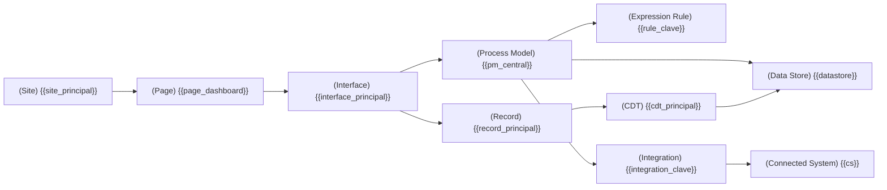

<!--
  Plantilla 02 — Arquitectura de la aplicación
  NO documentar la arquitectura genérica de Appian. SOLO los objetos REALES de esta app y sus relaciones.
  Reemplaza todos los {{placeholders}}.
-->

# Arquitectura de la aplicación

> Esta sección describe la arquitectura **de esta aplicación concreta**, no la arquitectura genérica de Appian. Cada nodo es un objeto real del export.

## Diagrama general

> Render del SVG en `diagrams/arquitectura.svg`. Si no se renderizó, se conserva el bloque Mermaid embebido aquí.

> Diagrama saneado según `references/mermaid-rules.md`. Si la densidad supera los 30 nodos, está partido en sub-diagramas por capa abajo.

## Capa de Presentación

Objetos cara al usuario: sites, pages, interfaces, record views.

| Objeto | Tipo | Descripción funcional | Apunta a |
|---|---|---|---|
| `{{site_1}}` | Site | {{para qué es este site}} | `{{record/interface_destino}}` |
| `{{page_1}}` | Page | {{qué muestra}} | `{{contenido}}` |
| `{{interface_1}}` | Interface | {{qué pantalla representa}} | usa `{{rule}}`, lee `{{record}}` |
| `{{recordView_1}}` | Record View | {{qué vista de record}} | `{{record}}` |

## Capa de Lógica

Process models, expression rules, decisions.

| Objeto | Tipo | Descripción funcional | Llama a |
|---|---|---|---|
| `{{pm_1}}` | Process Model | {{qué hace}} | `{{subprocs/rules/integraciones}}` |
| `{{rule_1}}` | Expression Rule | {{qué calcula/devuelve}} | `{{otras rules / records}}` |
| `{{decision_1}}` | Decision | {{qué decide}} | — |

## Capa de Datos

Record Types, CDTs, Data Stores, tablas.

| Objeto | Tipo | Fuente | Detalle |
|---|---|---|---|
| `{{record_1}}` | Record Type | DB / Service / Process / Expression | CDT `{{cdt}}`, tabla `{{tabla}}` |
| `{{cdt_1}}` | CDT | `.xsd` | mapeado a tabla `{{tabla}}` |
| `{{ds_1}}` | Data Store | JNDI `{{jndi}}` | entidades: `{{lista}}` |

Detalle completo en [03-modelo-datos.md](./03-modelo-datos.md).

## Capa de Integración

Connected Systems, Integrations, Web APIs.

| Objeto | Tipo | Sistema externo | Sentido |
|---|---|---|---|
| `{{cs_1}}` | Connected System | {{SAP/Salesforce/…}} | saliente |
| `{{int_1}}` | Integration | usa `{{cs_1}}` | saliente |
| `{{webapi_1}}` | Web API | — | entrante |

Detalle completo en [05-integraciones-consumidas.md](./05-integraciones-consumidas.md) y [06-apis-expuestas.md](./06-apis-expuestas.md).

## Acoplamientos / patrones detectados

- {{Patrón_1, p. ej. "Process model X delega en Y vía sub-process, y Y vuelve a X vía start-process. Acoplamiento bidireccional 🟡."}}
- {{Patrón_2, p. ej. "Todos los procesos de la app pasan por el record `RT_Auditoria` para escribir histórico."}}
- {{Patrón_3, p. ej. "Integraciones encapsuladas en expression rules `INT_*`. Buen patrón ✅."}}

## Objetos transversales (cross-cutting)

{{Constantes, expression rules o records que son usados por muchos objetos y conviene conocer al entrar al proyecto.}}

| Objeto | Tipo | Veces referenciado | Propósito |
|---|---|---|---|
| `{{shared_1}}` | Constant | {{n}} | {{para qué se usa}} |
| `{{shared_2}}` | Expression Rule | {{n}} | {{para qué se usa}} |

## Notas de arquitectura

- {{Nota 1: cosas que conviene saber para no romper algo. P. ej. "Toda escritura a `RT_Expediente` pasa por el process model `PM_Expediente_Persistir`, no escribir directo."}}
- {{Nota 2}}
- {{Nota 3}}

> Estado: ✅/🔵 — Evidencia: grafo de dependencias en `_graph.json` (Fase 3).
