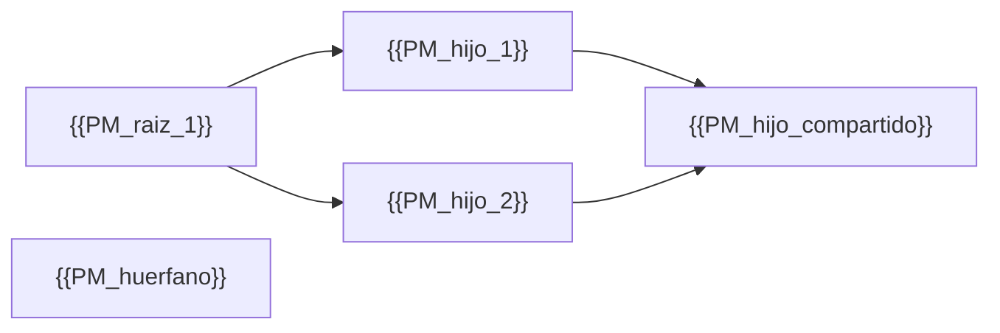

<!--
  Plantilla 08 — Índice de procesos en BPMN 2.0
  Sigue las reglas de `references/presentation-rules.md` (cascada TL;DR → Vista → Detalle).

  Para CADA process model se entrega doble artefacto en esta carpeta:
    - <PM>.bpmn   ← BPMN 2.0 XML semántico (fuente para Camunda/draw.io/bpmn.io)
    - <PM>.mmd    ← Mermaid Tipo C (vista preliminar)
    - <PM>.svg    ← Render del .mmd (si mmdc disponible)
    - <PM>.md     ← Documento con TL;DR + diagrama embebido + fichas
-->

# Procesos en BPMN 2.0 — Índice

> **TL;DR**: {{N process models}}. {{N raíz / N hijos / N huérfanos}}. {{Trigger principal: manual / web API / timer}}.
> Cada proceso se entrega en **doble formato**: `.bpmn` (abre en Camunda/draw.io para vista profesional) y `.mmd/.svg` (vista preliminar embebida en el `.md`).
> Empezar por el mapa global de procesos abajo, luego entrar al proceso de interés desde la tabla.

## Vista — Mapa global de procesos

> Relaciones padre→hijo→hermano entre todos los process models de la app. Derivado de `a!startProcess(...)` y `<processModelUuid>` de los sub-procesos.

> Saneado según `references/mermaid-rules.md` (Tipo A). Si supera 30 nodos, partir por subdominio.

### Leyenda

- **Raíz**: invocado desde sites, web APIs, related actions o batches.
- **Hijo**: invocado solo desde otros process models (sub-process o `a!startProcess`).
- **Compartido**: invocado por varios padres (hub funcional).
- **Huérfano**: sin caller detectado en el export — pendiente de validación con el equipo.

## Vista — Tabla de procesos

> Una fila por process model. Click en "📐 BPMN" para abrir el `.bpmn` en una herramienta profesional; click en "📄 .md" para ver la ficha con la vista preliminar.

| Process Model | Trigger | Lanes | Pools externos | Críticos | Subprocesos | Integraciones | Fuente | Ficha |
|---|---|---|---|---|---|---|---|---|
| `{{pm_1}}` | manual | 2 (Operator, Approver) | 1 (SAP) | 🔴 | `{{PM_hijo_1}}` | `{{int_1}}` | [📐 BPMN](./{{pm_1}}.bpmn) | [📄 .md](./{{pm_1}}.md) |
| `{{pm_2}}` | timer (cada lunes) | 0 | 0 | 🟡 | `{{PM_hijo_X}}` | `{{int_2}}` | [📐 BPMN](./{{pm_2}}.bpmn) | [📄 .md](./{{pm_2}}.md) |
| `{{pm_3}}` | web API | 1 | 0 | 🔵 | — | — | [📐 BPMN](./{{pm_3}}.bpmn) | [📄 .md](./{{pm_3}}.md) |

### Cómo abrir un `.bpmn`

1. **bpmn.io demo** (web, instantáneo): https://demo.bpmn.io/new — copia y pega el contenido del `.bpmn`.
2. **draw.io / diagrams.net**: File → Open → seleccionar el `.bpmn`.
3. **Camunda Modeler** (desktop): File → Open File.
4. **Signavio** (web profesional): Import → BPMN 2.0 XML.

Cualquiera de estas calculará el layout y mostrará iconos BPMN auténticos (círculos finos para start, círculos gruesos para end, rectángulos con esquinas redondeadas para tareas, rombos con marcas para gateways).

## Convención visual de los `.mmd`/`.svg` (vista preliminar)

> Los `.mmd` siguen el **Tipo C** de `references/mermaid-rules.md`. Convención de iconos y colores:

| Tipo de elemento | Shape | Color | Icono |
|---|---|---|---|
| Start Event | Círculo verde claro | `#a8e6cf` | (ninguno) / ⏰ timer / ✉ message |
| User Task | Rectángulo amarillo | `#fff4d2` | 👤 |
| Service Task (Integración) | Rectángulo azul | `#d0e7ff` | 🔌 |
| Service Task (DataStore / Records) | Rectángulo azul | `#d0e7ff` | 💾 / 📋 |
| Service Task (Query) | Rectángulo azul | `#d0e7ff` | 🔍 |
| Send Task / Email | Rectángulo violeta | `#e0d4ff` | 📧 |
| Receive Task | Rectángulo violeta | `#e0d4ff` | 📥 |
| Script Task | Rectángulo gris | `#e8e8e8` | 📜 |
| Call Activity (sub-proceso) | Rectángulo verde con borde grueso | `#cfe2cf` | ➡️ |
| Gateway (XOR/AND/OR) | Rombo amarillo | `#fff8a5` | — / + / O |
| End Event (none) | Círculo doble naranja | `#ffd3b6` | (ninguno) |
| End Event (terminate) | Círculo doble rojo | `#ffaaa5` | ⊗ |
| Boundary Error Event | Flecha punteada | — | ⚠ |

## Procesos con render pendiente

> Si algún `.svg` no se pudo generar por falta de `mmdc`, aparecerá aquí. El bloque Mermaid del `.mmd` sigue embebido en el `.md` y se renderiza al vuelo en GitHub/VSCode.

| Process Model | Fichero fuente | Motivo |
|---|---|---|
| `{{pm_X}}` | `./{{pm_X}}.mmd` | mmdc no disponible al generar; bloque Mermaid embebido en `./{{pm_X}}.md` |

> Si todos renderizaron, escribir: "Todos los diagramas renderizaron correctamente."

---

## Resumen rápido

- Total process models: {{N}}.
- Renderizados a SVG: {{N}}. Pendientes: {{N}}.
- Procesos raíz (con caller externo): {{N}}. Hijos: {{N}}. Huérfanos: {{N}}.
- Procesos con sistemas externos (pools): {{N}}.
- Profundidad máxima padre→hijo: {{N}}.
- Procesos críticos detectados: {{lista_top_3}}.
- Procesos con manejo de errores explícito: {{N}} / {{N}}.
