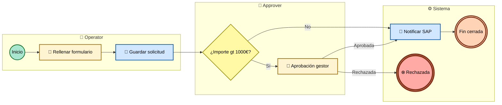

<!--
  Plantilla 08 — Process model individual
  Cada PM se documenta en su propio .md hermano del .bpmn / .svg.
  Estructura: TL;DR · Diagramas (preview + profesional) · Detalle estructurado · Hallazgos.
  Claude DEBE generar uno de estos por cada process model identificado en Fase 2.
-->

# {{PM_NombreTecnico}} — {{nombre_visible}}

## 🎯 TL;DR

> Una frase: qué problema de negocio resuelve este proceso. Sin jerga Appian.

{{Ejemplo: "Gestiona el alta y aprobación de expedientes administrativos, con escalado al gestor cuando el importe supera 1000€ y notificación final a SAP para registro contable."}}

## 📋 Datos clave

| Atributo | Valor |
|---|---|
| Trigger | manual / web API / timer / mensaje |
| Frecuencia (si timer) | {{cron + lenguaje humano}} |
| Actores (lanes) | `{{Operator}}`, `{{Approver}}` |
| Sistemas externos (pools) | {{SAP}}, {{Salesforce}} o "ninguno" |
| Subprocesos invocados | {{lista de PMs hijos}} |
| Process models que lo invocan | {{lista de PMs padres}} |
| Integraciones consumidas | {{lista}} |
| Data Stores tocados | {{lista de RTs/CDTs}} |
| User tasks | {{N}} |
| Service tasks | {{N}} |
| Gateways | {{N}} |
| Complejidad estimada | Baja / Media / Alta |
| Estado | ✅ Confirmado · Evidencia: `{{ruta_xml}}` |

## 🖼 Diagrama (vista preliminar)

> Vista preliminar Mermaid Tipo C. Para BPMN profesional auténtico, abrir [`{{PM}}.bpmn`](./{{PM}}.bpmn) en Camunda Modeler, draw.io o [bpmn.io](https://demo.bpmn.io).

> Si el SVG no se renderizó: bloque Mermaid embebido aquí (GitHub/VSCode lo renderizan on-the-fly):

## 📐 Diagrama BPMN profesional

Para abrir el `.bpmn` en una herramienta BPMN profesional:

- **Camunda Modeler** (desktop, gratis): File → Open → `{{PM}}.bpmn`
- **bpmn.io demo** (web): subir `{{PM}}.bpmn` a https://demo.bpmn.io
- **draw.io** (web/desktop): File → Import from → Device → seleccionar `{{PM}}.bpmn`

El `.bpmn` contiene la semántica BPMN 2.0 completa (lanes, pools, message flows, boundary events, sequence flows con condiciones). El preview SVG es una simplificación visual.

## 🔁 Paso a paso del flujo

> Narrativa funcional en lenguaje de negocio. Sin jerga Appian salvo donde marquemos "implementado como".

1. **{{Paso 1 funcional}}** — implementado como `(Inicio) {{nombre_node}}`.
2. **{{Paso 2 funcional}}** — implementado como `[UserTask] {{nombre_node}}` asignado a `{{grupo}}`.
3. **{{Paso 3 funcional}}** — implementado como `[ServiceTask·DataStore] {{nombre_node}}` que escribe en `{{RT}}`.
4. **{{Decisión}}** — implementado como Gateway exclusivo: `{{condición}}`.
   - Rama "Sí" → {{descripción}}.
   - Rama "No" → {{descripción}}.
5. **{{Paso N}}** — implementado como `(Fin) {{nombre_node}}`.

## 🔌 Integraciones y data stores que toca

### Integraciones consumidas

| Integration | Sistema externo | Operación | Nodo |
|---|---|---|---|
| `{{int_1}}` | {{SAP}} | POST /expedientes | `Task_NotifySap` |

### Data stores tocados

| Record Type / CDT | Operación | Nodo | Detalle |
|---|---|---|---|
| `{{RT_Expediente}}` | escritura | `Task_Save` | Guarda registro inicial |
| `{{RT_Aprobacion}}` | escritura | `Task_Approve` | Registra decisión |

## 👥 Asignación de tareas

| User Task | Asignación | SLA | Escalation |
|---|---|---|---|
| `Task_Form` | grupo `Operator` (`{{regla_asignacion}}`) | {{tiempo o "ninguno"}} | {{notificación o "ninguna"}} |
| `Task_Approve` | grupo `Approver` | {{tiempo}} | {{notificación}} |

## ⚠️ Manejo de excepciones

| Excepción detectada | Cómo se maneja | Riesgo |
|---|---|---|
| {{tipo_excepcion}} | {{boundary event / alert node / sin manejo}} | 🔴/🟡/✅ |

> Si no hay manejo, marcar 🔴 y derivar a `09-valor-adicional.md` → Riesgos.

## 🔍 Hallazgos sobre este proceso

> Solo si hay algo no trivial. Si no, omite esta sección.

- 🔴 {{Riesgo concreto identificado}}.
- 🟡 {{Posible mejora}}.
- 🔵 {{Patrón notable}}.

## 📁 Ficheros relacionados

- Diagrama BPMN profesional: [`{{PM}}.bpmn`](./{{PM}}.bpmn)
- Vista preliminar SVG: [`{{PM}}.svg`](./{{PM}}.svg)
- Fuente Mermaid: [`{{PM}}.mmd`](./{{PM}}.mmd)
- XML original Appian: `../{{ruta_relativa_pm_xml}}`
