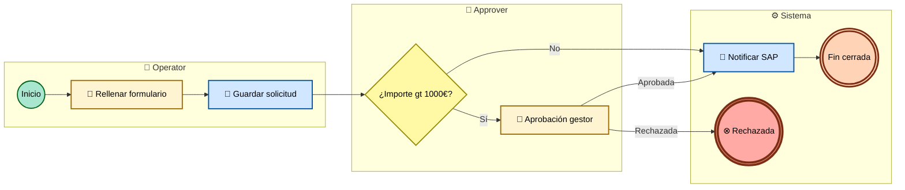

# Mapeo Appian → BPMN 2.0

Guía para traducir process models nativos de Appian a notación **BPMN 2.0 estándar**. Léelo antes de escribir cualquier diagrama de la carpeta `08-procesos-bpmn/`.

---

## Estrategia híbrida: doble entrega por process model

Por cada process model del export, Claude genera **dos artefactos**:

| Artefacto | Para qué | Tooling necesario | Resultado |
|---|---|---|---|
| **`<PM>.bpmn`** XML semántico BPMN 2.0 | Vista BPMN profesional auténtica con iconos estándar | Ninguno para generar. Para verlo: Camunda Modeler, draw.io, bpmn.io demo, Signavio | Calidad BPMN industrial. Editable. Reutilizable. |
| **`<PM>.mmd`** Mermaid Tipo C + **`<PM>.svg`** | Vista preliminar embebida en `<PM>.md`, legible sin abrir otra herramienta | `mmdc` (opcional; si falta, el bloque mermaid se embebe en el `.md`) | Iconos BPMN-like, lanes/swimlanes, colores por tipo de tarea, flechas con etiquetas |

**Por qué esta dualidad:**

- El `.bpmn` es BPMN 2.0 estándar puro. Cualquier modelador profesional lo abre y calcula el layout con iconos auténticos (círculos finos para start, círculos gruesos para end, rectángulos redondeados para tareas, rombos con marcas para gateways).
- El `.mmd` Tipo C es la vista que el usuario ve **al abrir el `.md` directamente** sin más herramienta. Está estilizado para parecerse a BPMN: shapes correctos por elemento, iconos emoji por categoría, colores por tipo, lanes visuales.
- El usuario puede preferir uno u otro según su contexto. Para entrega de documentación a equipos no-Appian, el `.bpmn` es el oro. Para revisión rápida en PR/GitHub, el `.svg` embebido basta.

---

## Por qué BPMN 2.0 (y no la notación Appian)

- Notación estándar ISO/OMG, reconocible por cualquier consultor BPM / arquitecto de procesos sin formación Appian.
- Renderizable con herramientas estándar (Camunda Modeler, draw.io, bpmn.io, Signavio). El `.bpmn` que produces se puede abrir y editar en cualquiera de estas.
- Permite separar **actores** (lanes) y **sistemas** (pools) de forma explícita y visual.
- Los iconos diferencian de un vistazo el tipo de elemento. Eso no se ve en la notación nativa de Appian.

---

## Tabla de mapeo (Appian → BPMN 2.0)

| Elemento Appian | Elemento BPMN 2.0 | Tag XML BPMN | Mermaid Tipo C |
|---|---|---|---|
| Start Node (vacío) | Start Event (none) | `<bpmn:startEvent>` | `Start((Inicio)):::startNode` |
| Start Node `<startType>message</startType>` | Message Start Event | `<bpmn:startEvent>` con `<bpmn:messageEventDefinition>` | `Start((✉ Inicio)):::startNode` |
| Start Node con `<recurrence>` / timer | Timer Start Event | `<bpmn:startEvent>` con `<bpmn:timerEventDefinition>` | `Start((⏰ Inicio)):::startNode` |
| User Input Task | User Task | `<bpmn:userTask>` | `T1[👤 Texto]:::userTask` |
| Script Task | Script Task | `<bpmn:scriptTask>` | `T1[📜 Texto]:::scriptTask` |
| Smart service: Write to Data Store Entity | Service Task | `<bpmn:serviceTask>` | `T1[💾 Escribir CDT]:::dataTask` |
| Smart service: Write Records | Service Task | `<bpmn:serviceTask>` | `T1[📋 Escribir RT]:::dataTask` |
| Smart service: Query Records / Query DB | Service Task | `<bpmn:serviceTask>` | `T1[🔍 Consultar]:::queryTask` |
| Smart service: Call Integration | Service Task | `<bpmn:serviceTask>` | `T1[🔌 Llamar X]:::serviceTask` |
| Smart service: Send Message | Throw Message Event | `<bpmn:intermediateThrowEvent>` con `<bpmn:messageEventDefinition>` | `T1[📤 Enviar]:::sendTask` |
| Smart service: Receive Message | Receive Task | `<bpmn:receiveTask>` | `T1[📥 Recibir]:::receiveTask` |
| Smart service: Send Email | Send Task | `<bpmn:sendTask>` | `T1[📧 Email]:::sendTask` |
| Sub-Process node | Call Activity | `<bpmn:callActivity calledElement="..."/>` | `S1[➡️ PM_Sub]:::callActivity` |
| Gateway exclusivo (XOR) | Exclusive Gateway | `<bpmn:exclusiveGateway>` | `G1{¿condición?}:::gateway` |
| Gateway paralelo (AND) | Parallel Gateway | `<bpmn:parallelGateway>` | `G1{+ AND}:::gateway` |
| Gateway inclusivo (OR) | Inclusive Gateway | `<bpmn:inclusiveGateway>` | `G1{O OR}:::gateway` |
| End Node (vacío) | End Event (none) | `<bpmn:endEvent>` | `End(((Fin))):::endNode` |
| End Node `<endType>terminate</endType>` | Terminate End Event | `<bpmn:endEvent>` con `<bpmn:terminateEventDefinition>` | `End(((⊗ Fin term))):::endNodeTerm` |
| Exception flow / Alert | Boundary Error Event | `<bpmn:boundaryEvent>` con `<bpmn:errorEventDefinition>` | flecha `-.->|⚠ error|` |

---

## Lanes y pools

- **Lanes** = actores internos (grupos Appian). Una lane por cada grupo distinto que aparece en `assignees` de las user tasks del PM.
- **Pools** = sistemas externos. Un pool por cada Connected System distinto referenciado por `Call Integration`.
- Si solo hay **1 lane y 0 pools externos**, omitir `<laneSet>` y `<collaboration>` en el `.bpmn` y omitir `subgraph` en el `.mmd` — el diagrama queda más limpio.
- Añadir una lane `Sistema` para nodos sin asignación humana (service tasks, gateways, start/end events que no son del usuario).

---

## Plantilla `.bpmn` (XML semántico — sin layout DI)

El `.bpmn` semántico es lo que Claude escribe. **No incluye `<bpmndi:BPMNDiagram>`** porque las herramientas profesionales (Camunda, draw.io, bpmn.io) calculan el layout automáticamente al abrirlo. Esto evita problemas de posicionamiento manual.

```xml
<?xml version="1.0" encoding="UTF-8"?>
<bpmn:definitions xmlns:bpmn="http://www.omg.org/spec/BPMN/20100524/MODEL"
                  xmlns:xsi="http://www.w3.org/2001/XMLSchema-instance"
                  id="Definitions_PM_GestionExpedientes"
                  targetNamespace="http://bpmn.io/schema/bpmn">

  <bpmn:collaboration id="Collab_1">
    <bpmn:participant id="Pool_Org" name="Organización" processRef="Process_PM"/>
    <bpmn:participant id="Pool_SAP" name="SAP ERP"/>
    <bpmn:messageFlow id="MF_1" sourceRef="Task_NotifySap" targetRef="Pool_SAP" name="Crear expediente"/>
  </bpmn:collaboration>

  <bpmn:process id="Process_PM" name="PM_GestionExpedientes" isExecutable="false">

    <bpmn:laneSet id="LaneSet_1">
      <bpmn:lane id="Lane_Operator" name="Operator">
        <bpmn:flowNodeRef>Start_1</bpmn:flowNodeRef>
        <bpmn:flowNodeRef>Task_Form</bpmn:flowNodeRef>
        <bpmn:flowNodeRef>Task_Save</bpmn:flowNodeRef>
      </bpmn:lane>
      <bpmn:lane id="Lane_Approver" name="Approver">
        <bpmn:flowNodeRef>Gateway_Amount</bpmn:flowNodeRef>
        <bpmn:flowNodeRef>Task_Approve</bpmn:flowNodeRef>
      </bpmn:lane>
      <bpmn:lane id="Lane_System" name="Sistema">
        <bpmn:flowNodeRef>Task_NotifySap</bpmn:flowNodeRef>
        <bpmn:flowNodeRef>End_1</bpmn:flowNodeRef>
        <bpmn:flowNodeRef>End_Rejected</bpmn:flowNodeRef>
      </bpmn:lane>
    </bpmn:laneSet>

    <bpmn:startEvent id="Start_1" name="Recepción de solicitud"/>
    <bpmn:userTask id="Task_Form" name="Rellenar formulario"/>
    <bpmn:serviceTask id="Task_Save" name="[DataStore] Guardar solicitud"/>
    <bpmn:exclusiveGateway id="Gateway_Amount" name="¿Importe &gt; 1000€?"/>
    <bpmn:userTask id="Task_Approve" name="Aprobación del gestor"/>
    <bpmn:serviceTask id="Task_NotifySap" name="[Integración] Notificar a SAP"/>
    <bpmn:endEvent id="End_1" name="Solicitud cerrada"/>
    <bpmn:endEvent id="End_Rejected" name="Solicitud rechazada">
      <bpmn:terminateEventDefinition/>
    </bpmn:endEvent>

    <bpmn:sequenceFlow id="F_1" sourceRef="Start_1" targetRef="Task_Form"/>
    <bpmn:sequenceFlow id="F_2" sourceRef="Task_Form" targetRef="Task_Save"/>
    <bpmn:sequenceFlow id="F_3" sourceRef="Task_Save" targetRef="Gateway_Amount"/>
    <bpmn:sequenceFlow id="F_4_si" name="Sí" sourceRef="Gateway_Amount" targetRef="Task_Approve"/>
    <bpmn:sequenceFlow id="F_5_no" name="No" sourceRef="Gateway_Amount" targetRef="Task_NotifySap"/>
    <bpmn:sequenceFlow id="F_6_aprob" name="Aprobada" sourceRef="Task_Approve" targetRef="Task_NotifySap"/>
    <bpmn:sequenceFlow id="F_7_rech" name="Rechazada" sourceRef="Task_Approve" targetRef="End_Rejected"/>
    <bpmn:sequenceFlow id="F_8" sourceRef="Task_NotifySap" targetRef="End_1"/>

  </bpmn:process>
</bpmn:definitions>
```

**Reglas clave para el `.bpmn` semántico:**

- IDs sin espacios, guiones, ni acentos (`Task_Form`, no `Tarea Formulario`).
- `sourceRef` y `targetRef` referencian IDs que existen en el mismo `<bpmn:process>`.
- Los caracteres especiales en nombres se escapan en XML (`&gt;`, `&lt;`, `&amp;`, `&quot;`).
- Cada nodo está dentro de exactamente una `<bpmn:lane>` (si hay `laneSet`).
- Los pools externos van en `<bpmn:collaboration>` con `messageFlow` cruzados.
- No incluir `<bpmndi:BPMNDiagram>`. Las herramientas profesionales lo añaden ellas con layout calculado.

**Cómo abrirlo (recomendar al usuario):**

1. **bpmn.io demo** (web, instantáneo): https://demo.bpmn.io/new — pegar el XML.
2. **draw.io / diagrams.net** (web o desktop): File → Open → seleccionar `.bpmn`.
3. **Camunda Modeler** (desktop): File → Open File.
4. **Signavio** (web profesional): Import → BPMN 2.0 XML.

---

## Plantilla `.mmd` Tipo C (Mermaid BPMN-styled — vista preliminar embebida)

El `.mmd` Tipo C es la vista que se incrusta en `<PM>.md` (bloque ` ```mermaid `) y se renderiza a `<PM>.svg` con `mmdc` si está disponible.



Especificación completa del Tipo C en `references/mermaid-rules.md`.

---

## Reglas para construir los dos artefactos por process model

Sigue este orden mecánico para cada `<pm>` del export:

1. **Detectar actores (lanes)**: lee `assignees` o `assigneesExpression` de cada `userInput` task. Una lane por grupo distinto. Añade una lane `Sistema` para nodos sin asignación humana.

2. **Detectar sistemas externos (pools)**: lee `<connectedSystem>` de cada `Call Integration`. Cada Connected System externo va en su propio pool. La interacción se modela como `messageFlow` cruzado (BPMN) o flecha cruzando subgraphs (Mermaid).

3. **Recorrer nodos del XML** (`<pm:node>`) en orden topológico siguiendo `<pm:flow source="..." target="..."/>`.

4. **Aplicar mapeo** de la tabla a cada nodo, generando ambos artefactos en paralelo.

5. **Nombrar cada nodo** con su nombre visible (`@name` o `<displayName>`):
   - En BPMN XML: escapar entidades especiales (`&gt;`, `&lt;`, `&amp;`).
   - En Mermaid Tipo C: usar `gt`/`lt` en lugar de `>`/`<`, sin comillas dobles internas.

6. **Conectar nodos** siguiendo `<pm:flow>`. Si el flow tiene `<condition>`:
   - En BPMN XML: `<bpmn:sequenceFlow name="<condición humana>">`.
   - En Mermaid Tipo C: etiqueta en el conector con `-->|"texto"|`.

7. **Exception flows / Alert nodes**:
   - En BPMN XML: `<bpmn:boundaryEvent>` con `<bpmn:errorEventDefinition>` adjunto a la actividad.
   - En Mermaid Tipo C: flecha punteada `-.->|"⚠ error"|` al manejador.

8. **Sub-Process** (`<pm:node type="subProcess">`) → en BPMN `<bpmn:callActivity calledElement="<PM_hijo>"/>`; en Mermaid `S1[➡️ <PM_hijo>]:::callActivity`. Enlazar al diagrama hijo desde `08-procesos-bpmn/indice.md`.

9. **Validación**:
   - BPMN XML: si hay `xmllint`, `xmllint --noout <PM>.bpmn` no debe dar errores.
   - Mermaid Tipo C: pasar por `scripts/validate_mermaid.py`.

10. **Render** (Fase 5): `scripts/render_diagrams.sh --batch 08-procesos-bpmn/` renderiza los `.mmd` a `.svg`. Los `.bpmn` se entregan sin renderizar (son fuente).

---

## Qué documentar en `08-procesos-bpmn/indice.md`

Una fila por process model con: nombre, trigger, actores (lanes), sistemas externos (pools), subprocesos invocados, integraciones, data stores, padre (caller), enlaces al `.bpmn` y al `.svg`/`.md`.

Añade también un **mapa global de procesos** (Mermaid Tipo A) que muestre las relaciones padre→hijo→hermano entre todos los process models. Es el índice navegable de alto nivel antes de bajar al detalle de cada uno.

Detalle completo en la plantilla `assets/markdown-templates/08-procesos-bpmn/indice.md`.

---

## Cómo se distribuye la información dentro de `<PM>.md`

Cada process model tiene su propio `.md` con esta estructura **fija** (ver plantilla):

1. **TL;DR** (3-5 líneas): qué hace el proceso, quién lo lanza, quién lo termina, en qué sistemas escribe.
2. **Diagrama** (BPMN o Mermaid embebido).
3. **Resumen rápido** (tabla 1 línea por nodo importante).
4. **Detalle por nodo** (acordeón mental: ficha técnica de cada nodo).
5. **Enlaces al `.bpmn`** y herramientas para abrirlo.

Esto asegura que el lector que solo necesita entender qué hace el proceso encuentra esa información en los primeros 30 segundos, y quien necesita el detalle lo tiene al pie sin que le abrume al inicio.
