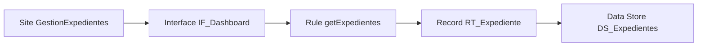
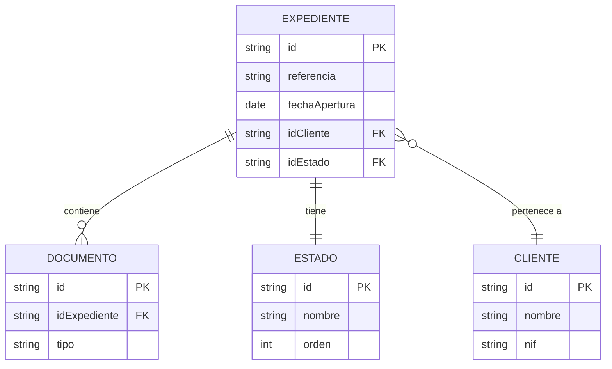
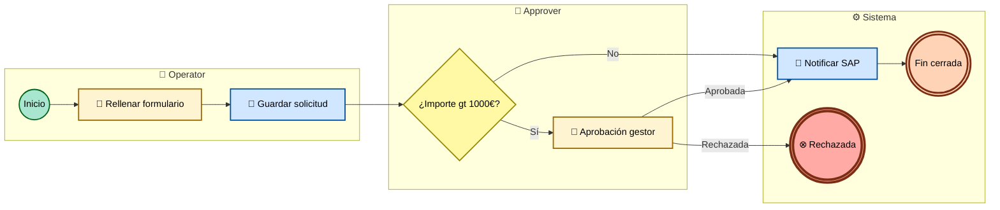
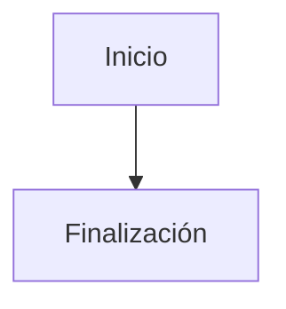
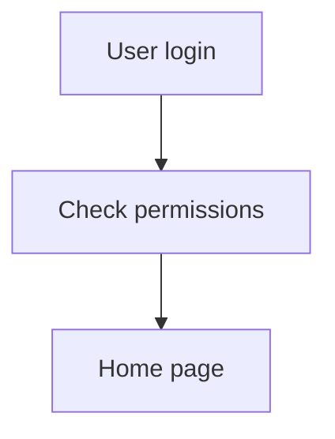
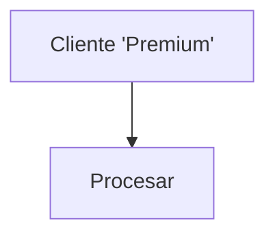

# Reglas obligatorias para Mermaid

Todos los diagramas Mermaid generados deben pasar estas reglas antes de escribirse. Si un diagrama no puede sanearse, **sustitúyelo por una tabla equivalente**.

## Subconjunto seguro de Mermaid — tres tipos permitidos

Solo se permiten estos tres tipos. Cada uno tiene reglas específicas; las **reglas comunes** están al final.

---

### Tipo A — `flowchart TD` / `flowchart LR` (uso general: arquitectura, jerarquía de grupos, vistas estructurales)

1. **Cabecera**: la primera línea no vacía es `flowchart TD` o `flowchart LR`.
2. **Nodos**:
   - Cuadrado: `N1["Texto"]`
   - Rombo (decisión): `N2{"Pregunta"}`
3. **Conectores**:
   - `-->` flecha sólida.
   - `--->` flecha larga.
   - `-.->` dependencia débil.
   - `-->|"Etiqueta"|` flecha con etiqueta (etiqueta entre comillas dobles).
4. **IDs**: solo `N1`, `N2`, `N3`, … (letra mayúscula N + número).
5. **Etiquetas**: siempre entre comillas dobles, máximo 50 caracteres, sin saltos de línea, sin comillas dobles internas (reemplazar por simples).
6. **Sin `classDef`**, sin `subgraph`, sin colores. Diagrama estructural sobrio.
7. **Máximo 30 nodos** por diagrama. Si excede, particionar.

---

### Tipo B — `erDiagram` (uso exclusivo: modelo de datos)

1. **Cabecera**: la primera línea no vacía es `erDiagram`.
2. **Entidades**: nombres en `PascalCase` o `SCREAMING_SNAKE_CASE` (sin espacios, guiones, acentos). Si el nombre técnico real tiene caracteres no permitidos, sustitúyelo por el equivalente saneado y deja en la tabla del documento el mapeo "nombre saneado ↔ nombre real".
3. **Relaciones**: solo estas notaciones canónicas:
   - `||--||` uno a uno.
   - `||--o{` uno a muchos (obligatorio).
   - `}o--||` muchos a uno (opcional).
   - `}o--o{` muchos a muchos.
   - Etiqueta de relación entre comillas dobles: `EXPEDIENTE ||--o{ DOCUMENTO : "contiene"`.
4. **Atributos dentro de entidad**: opcionales pero recomendados para campos clave. Si se incluyen, máximo 8 por entidad y formato `tipo nombre [PK|FK] comentario`:
   ```
   EXPEDIENTE {
     string id PK
     string idCliente FK
     date fechaApertura
   }
   ```
5. **Particionamiento del modelo de datos**: no hay un **techo duro** de entidades — los modelos de datos en proyectos Appian reales pueden tener decenas o cientos de entidades, y truncarlos sería peor que mostrarlos. La regla es de **legibilidad**, no de tamaño absoluto:
   - **Hasta ~15 entidades**: un único `erDiagram` global está bien.
   - **De ~15 a ~30**: un diagrama global resumido (solo entidades clave + relaciones principales) **más** diagramas de detalle por subdominio.
   - **Más de ~30**: obligatorio **siempre** partir en sub-diagramas por subdominio funcional. Cada sub-diagrama debe contener un subdominio coherente (típicamente 8-15 entidades). El documento global debe incluir un "mapa de subdominios" como índice navegable.
   - **El criterio no es un número, es la legibilidad**: si el diagrama queda apretado, ilegible o requiere zoom extremo para leerlo, está mal particionado.
   - **Nunca omitas entidades** del catálogo (en las tablas) — partir afecta solo a los diagramas visuales, no al inventario.

---

### Tipo C — `flowchart BPMN-styled` (uso exclusivo: procesos en `08-procesos-bpmn/`)

Subtipo de `flowchart LR` con shapes, iconos y `classDef` específicos para emular notación BPMN 2.0 visualmente. Es la **vista preliminar embebida**; el `.bpmn` XML hermano sigue siendo la fuente para herramientas BPMN profesionales (Camunda Modeler, draw.io, bpmn.io, Signavio).

1. **Cabecera**: `flowchart LR` (siempre horizontal para procesos).

2. **Shapes por tipo de elemento BPMN**:

   | Elemento BPMN | Shape Mermaid | Patrón |
   |---|---|---|
   | Start Event (none) | Círculo | `Start((Inicio)):::startNode` |
   | Start Event (timer) | Círculo con icono | `Start((⏰ Inicio)):::startNode` |
   | Start Event (message) | Círculo con icono | `Start((✉ Inicio)):::startNode` |
   | User Task | Rectángulo con icono | `T1[👤 Aprobar solicitud]:::userTask` |
   | Service Task (Integración) | Rectángulo con icono | `T2[🔌 Llamar SAP]:::serviceTask` |
   | Service Task (DataStore) | Rectángulo con icono | `T3[💾 Guardar expediente]:::dataTask` |
   | Service Task (Records) | Rectángulo con icono | `T4[📋 Escribir RT_Expediente]:::dataTask` |
   | Service Task (Query) | Rectángulo con icono | `T5[🔍 Consultar pedidos]:::queryTask` |
   | Send Task / Email | Rectángulo con icono | `T6[📧 Notificar cliente]:::sendTask` |
   | Receive Task | Rectángulo con icono | `T7[📥 Esperar confirmación]:::receiveTask` |
   | Script Task | Rectángulo con icono | `T8[📜 Calcular total]:::scriptTask` |
   | Call Activity (Sub-Process) | Rectángulo con icono | `S1[➡️ PM_Subproceso]:::callActivity` |
   | Exclusive Gateway (XOR) | Rombo con marca X | `G1{¿Importe gt 1000€?}:::gateway` |
   | Parallel Gateway (AND) | Rombo con marca + | `G2{+ AND}:::gateway` |
   | Inclusive Gateway (OR) | Rombo con marca O | `G3{O OR}:::gateway` |
   | End Event (none) | Círculo doble | `End(((Fin))):::endNode` |
   | End Event (terminate) | Círculo doble | `End2(((⊗ Fin terminate))):::endNodeTerm` |
   | End Event (message) | Círculo doble | `End3(((✉ Fin mensaje))):::endNode` |
   | Boundary Error Event | Flecha punteada al manejador | `T1 -.->|"⚠ error"| H1` |

3. **Lanes (actores)**: se reflejan como `subgraph` (excepcionalmente permitido en Tipo C):

   ```
   subgraph LO["👥 Operator"]
     Start((Inicio)):::startNode
     T1[👤 Rellenar formulario]:::userTask
   end
   subgraph LA["👥 Approver"]
     T2[👤 Aprobar]:::userTask
   end
   subgraph LS["⚙️ Sistema"]
     T3[🔌 Notificar SAP]:::serviceTask
     End(((Fin))):::endNode
   end
   ```

4. **classDef obligatorio** al final del diagrama (excepcionalmente permitido en Tipo C):

   ```
   classDef startNode fill:#a8e6cf,stroke:#02631a,stroke-width:2px,color:#000
   classDef endNode fill:#ffd3b6,stroke:#7c2d12,stroke-width:3px,color:#000
   classDef endNodeTerm fill:#ffaaa5,stroke:#7c2d12,stroke-width:4px,color:#000
   classDef userTask fill:#fff4d2,stroke:#9c6900,stroke-width:2px,color:#000
   classDef serviceTask fill:#d0e7ff,stroke:#0050a2,stroke-width:2px,color:#000
   classDef dataTask fill:#d0e7ff,stroke:#0050a2,stroke-width:2px,color:#000
   classDef queryTask fill:#d0e7ff,stroke:#0050a2,stroke-width:2px,color:#000
   classDef sendTask fill:#e0d4ff,stroke:#4a148c,stroke-width:2px,color:#000
   classDef receiveTask fill:#e0d4ff,stroke:#4a148c,stroke-width:2px,color:#000
   classDef scriptTask fill:#e8e8e8,stroke:#444,stroke-width:2px,color:#000
   classDef callActivity fill:#cfe2cf,stroke:#1b5e20,stroke-width:3px,color:#000
   classDef gateway fill:#fff8a5,stroke:#9c8a00,stroke-width:2px,color:#000
   ```

5. **Reglas adicionales para Tipo C**:
   - IDs en `PascalCase` o `camelCase` (más legibles para procesos), no `N1`/`N2`.
   - Etiquetas pueden incluir emojis Unicode (iconos visuales por tipo BPMN).
   - Etiquetas **sin** comillas dobles internas. Usa `gt` y `lt` en lugar de `>` y `<` para evitar problemas de parseo Mermaid (ej. `¿Importe gt 1000€?`).
   - Máximo 25 nodos por diagrama. Si excede, partir el proceso en sub-procesos / call activities.
   - **Siempre acompañado de un `.bpmn` XML hermano** para abrir en herramientas BPMN profesionales (ver `bpmn-mapping.md`).

---

## Reglas comunes a los tres tipos

- **No HTML** dentro de etiquetas (`<br>`, `<b>`, etc.).
- **No iconos** `fa:fa-*` de FontAwesome (los emojis Unicode sí son OK en Tipo C).
- **No** etiquetas con `end` en minúscula (palabra reservada en Mermaid). Sustituir por "Fin", "Finalización" o "EndNode".
- **No** IDs que empiecen por `o` o `x` minúsculas (algunos parsers los interpretan como conectores `o--` o `x--`). En Tipo A usa siempre prefijo `N`; en Tipo C arranca con mayúscula (`Start`, `Task1`, `Gateway1`).
- **No** caracteres especiales en IDs (`-`, espacios, acentos, `.`, `/`).
- **No** comillas dobles dentro de etiquetas.
- **No** saltos de línea dentro de etiquetas.

## Algoritmo de saneamiento (Tipo A y C)

Antes de escribir un diagrama, aplica este procedimiento (o usa `scripts/validate_mermaid.py`):

1. **Verifica cabecera**: primera línea no vacía debe ser `flowchart TD/LR` (Tipo A/C) o `erDiagram` (Tipo B). Si no, rechaza.
2. **Renombra IDs** según las reglas de cada tipo, manteniendo un mapa para reemplazar referencias.
3. **Sustituye etiquetas vacías** por `"Elemento sin nombre"`.
4. **Sustituye `end` literal** en etiquetas por `"Finalización"`.
5. **Escapa comillas dobles internas** → comillas simples.
6. **Reemplaza saltos de línea** internos por espacio simple.
7. **Trunca etiquetas** a 50 caracteres con `…` al final si exceden.
8. **Valida que cada flecha referencia nodos existentes**. Si no, rechaza.
9. **Valida que no hay nodos duplicados** (mismo ID, etiquetas distintas).
10. **Valida límites de tamaño** por tipo:
    - Tipo A (`flowchart`): ≤ 30 nodos.
    - Tipo B (`erDiagram`): **sin techo absoluto**, pero si un solo diagrama queda ilegible (más de ~15-30 entidades), **particiona por subdominio** y añade un mapa de subdominios como índice navegable. Nunca omitas entidades — el inventario en tablas debe seguir cubriendo el 100% del export.
    - Tipo C (`flowchart` BPMN-styled): ≤ 25 nodos por proceso. Si excede, partir en sub-procesos / call activities.
    Si un diagrama Tipo A o C excede el límite, divide o convierte a tabla.

Si el saneamiento no puede completarse limpiamente, no escribas el diagrama: emite una tabla alternativa con la misma información.

## Plantilla de tabla alternativa

Cuando no puedas usar Mermaid, usa esta tabla:

```markdown
> Diagrama representado como tabla por motivos de compatibilidad o tamaño.

| Origen | Tipo | Relación | Destino | Tipo | Etiqueta |
|---|---|---|---|---|---|
| Usuario | Actor | accede a | Site principal | Site | — |
| Site principal | Site | invoca | Process Model X | Process Model | Crear pedido |
| ... | ... | ... | ... | ... | ... |
```

## Ejemplos correctos

### Tipo A — Arquitectura



### Tipo B — Modelo de datos



### Tipo C — Proceso BPMN-styled



## Ejemplos incorrectos y su corrección

### ❌ Mal: `end` como ID/etiqueta

```mermaid
flowchart TD
  start[Inicio] --> end
```

### ✅ Bien



---

### ❌ Mal: IDs con caracteres especiales y sin comillas

```mermaid
flowchart TD
  user-login --> check.permissions --> home page
```

### ✅ Bien



---

### ❌ Mal: etiquetas con HTML y comillas dobles internas

```mermaid
flowchart TD
  A[Cliente<br>"Premium"] --> B[Procesar]
```

### ✅ Bien



---

### ❌ Mal: ER con 25 entidades en un solo diagrama

→ ✅ Partir en sub-diagramas por subdominio (máx 12 por sub-diagrama). Añadir un "diagrama de subdominios" como índice navegable.

### ❌ Mal: Tipo C con etiqueta `¿Importe > 1000€?`

→ ✅ `¿Importe gt 1000€?` (el `>` rompe el parseo de Mermaid en algunos contextos).

## Render con `mmdc` (mermaid-cli)

Los `.mmd` saneados se renderizan a `.svg` con `@mermaid-js/mermaid-cli`:

```bash
# Instalación
npm install -g @mermaid-js/mermaid-cli

# Render
mmdc -i diagrama.mmd -o diagrama.svg -t neutral -b transparent
```

`scripts/render_diagrams.sh` automatiza el render en lote.

Si `mmdc` no está disponible:

- Deja el `.mmd` en `_doc_generada/diagrams/` o `_doc_generada/08-procesos-bpmn/`.
- Embebe el contenido también dentro del Markdown asociado en un bloque ` ```mermaid` para que GitHub/VSCode/preview Markdown lo renderice on-the-fly.
- Registra el pendiente para listarlo en la respuesta final.

## Render de BPMN — estrategia híbrida

Los process models de `08-procesos-bpmn/` se entregan en **doble formato**:

1. **`.bpmn` XML semántico** — siempre. Sin dependencias de render. Abre en Camunda Modeler, draw.io, bpmn.io, Signavio para vista BPMN profesional auténtica. Ver `bpmn-mapping.md`.
2. **`.mmd` Tipo C + `.svg`** — vista preliminar embebida en `<PM>.md`, suficientemente fiel a BPMN (iconos, shapes, colores, lanes) para entender el proceso sin abrir otra herramienta.
